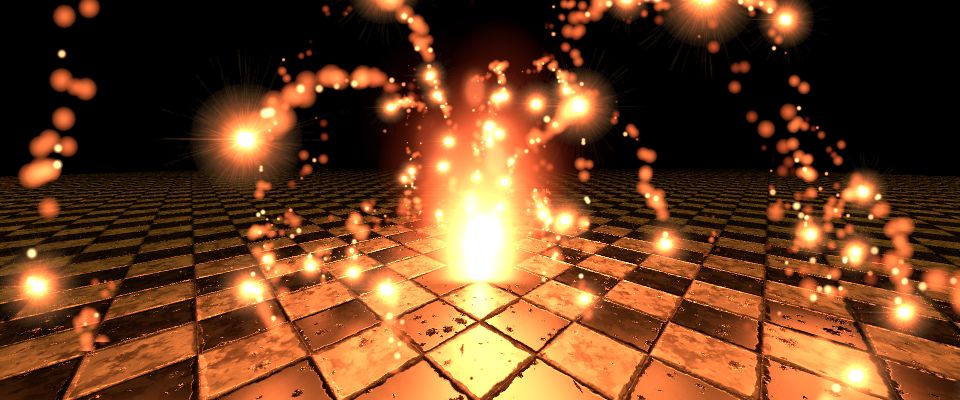

# Three Fires



Three.jsの`WebGPURenderer`で動く炎のデモです。

```sh
npm install
npm run dev
```

ドラッグまたは1本指のスワイプでカメラを旋回し、マウスホイールで距離を変更できます。

```sh
npm run build
npm run lint
```

## 制作の経緯

このデモは、2013年にFlashで制作した炎の作例を、時代ごとのウェブ3D技術へ移植しながら発展させたものです。

| 年 | バージョン |
| --- | --- |
| 2013年 | **初版（Flash）** — [Flash Stage3D対応のAway3D作例 – 燃えさかる炎の表現](https://clockmaker.jp/blog/2013/02/away3d-fire-particles/) |
| 2014年 | **Away3D TypeScript版** — [HTML5で燃えさかる炎の表現に挑戦！ WebGL対応のJSライブラリAway3Dはパーティクル機能がかなり魅力的](https://clockmaker.jp/blog/2014/01/away3d-typescript-fire/) |
| 2026年 | **Three.js版** — `WebGPURenderer`を使って本デモへ移植 |

本デモは、ICS MEDIAの記事[「WebGPU・WebGL入門 - サンプルで理解する3D表現の迫力」](https://ics.media/entry/2328/)にも掲載しています。
